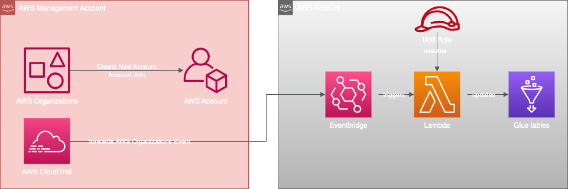

# AWS Athena Auto Update Index
[](https://docs.aws.amazon.com/cdk/v2/guide/home.html)
[](https://docs.aws.amazon.com/cdk/v2/guide/home.html)


## Description

In this CDK project are all the resources that updated glue indexes for Athena Tables automated. You can find more information about this solution at this [blogpost](htps://globaldatanet.com/tech-blog/serverless-querying-and-evaluating-of-logs-using-athena-part-2). 

## Architecture


The CDK stack "YOURPREFIX-CF-STACK-GlueIndexAutoupdate" rolls out a central EventBus in which a "PutEvent" from the management account is allowed, furthermore it rolls out a Lambda function that extends Athena Table ConfigurationsParameters with newly created AWS AccountIds, so that these appear in the index and are therefore "query" bar in the Athena Console. The Lambda is triggered by the forwarded events from the billing account.

The CDK stack "YOURPREFIX-CF-STACK-SSO-EVENTRULE" rolls out an event rule that forwards the following events ( CreateAccountResult - for newly created accounts & AcceptHandshake - for newly imported accounts into the organization) into the logging account.

## Deployment

### Prerequisites

- `aws` CLI Version 2.x
- `cdk` Version 2.x
- `docker` or `esbuild` for transpiling from the lambda function (with docker an esbuild image is downloaded)

### Deployment

#### Glue Index Automation Stack
For deployment, a valid session must first exist in the logging account (logging) in the shell. Deployment then works via:
```
cdk deploy YOURPREFIX-CF-STACK-GlueIndexAutoupdate
```

Configuration-file `logging.ts` exist in folder `values`.

#### Organization Forward Rule

For deployment, a valid session must first exist in the billing account (management) in the shell. Deployment then works via:

```
cdk deploy YOURPREFIX-CF-STACK-SSO-EVENTRULE
```
